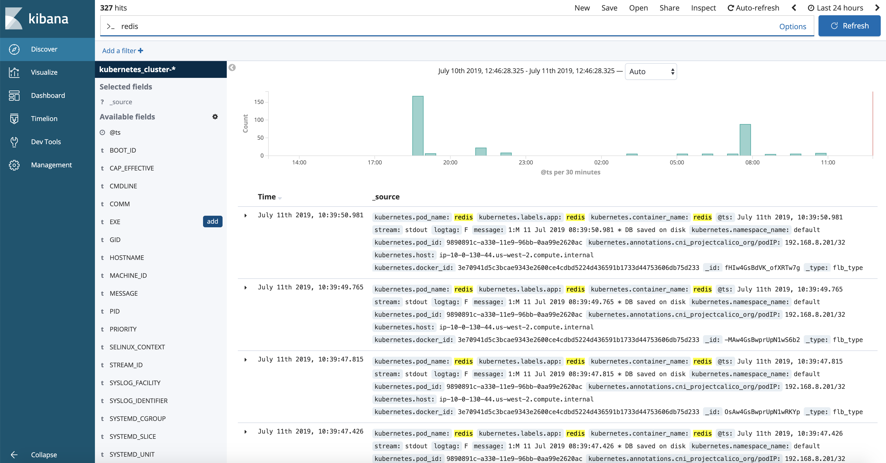
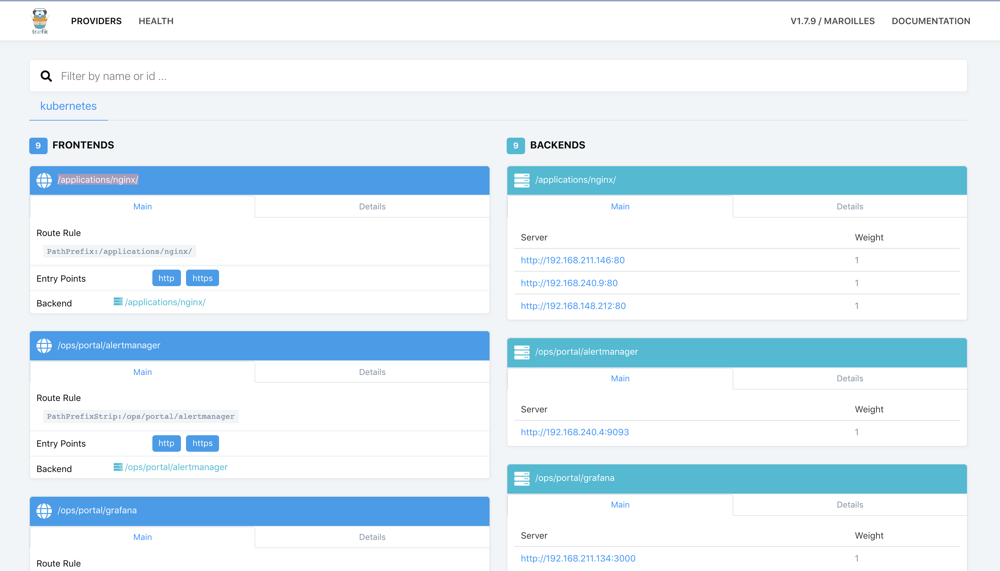
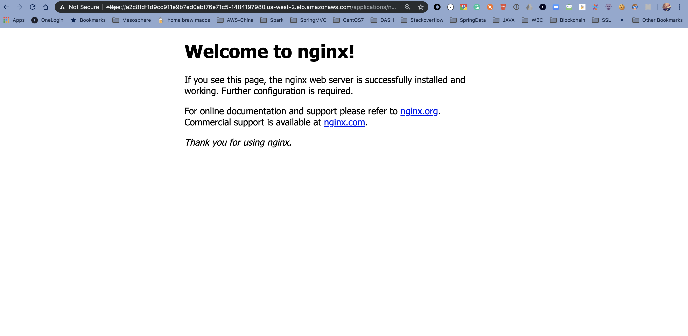

# Kubernetes workshop Day1 

## Introduction

During this workshop, you'll learn how to deploy Kuberenetes using Konvoy and to use its main features:

* [Introduction](#introduction)
* [Prerequisites](#prerequisites)
* [1. Deploy a Kubernetes cluster using Konvoy](#)
* [2. Scale Masters/Workers of a Konvoy k8s cluster](#8-scale-a-konvoy-cluster)
* [3. Scale a K8s Application using HPA ](#3-scale-a-k8s-Application)
* [4. Konvoy monitoring](#9-konvoy-monitoring)
* [5. Konvoy logging/debugging](#10-konvoy-loggingdebugging)
* [6. Upgrade a Konvoy cluster](#11-upgrade-a-konvoy-cluster)
* [7. Destroy a Konvoy cluster](#12-destroy-a-konvoy-cluster)

## Prerequisites

You need either a Linux, MacOS or a Windows laptop.


## Jumpserver

Jumpservers have been deployed for each student with all prerequisites installed. First, go to the student data spreadsheet and select a host by entering your name.  Then, download the ssh-private-key (id_rsa_student#) and change the file permissions.  Finally, ssh to the ipaddress of your assigned jumpserver using the -i option to specify the identity file to be used.  The username for the Jumpserver is "centos".

For Mac and Linux clients you must change the permission on the file.
```
chmod 400 id_rsa_student#
```

```
ssh -i id_rsa_student# centos@jumpserver-ip-address
```


>For Windows, you need to use the [Google Cloud Shell](https://console.cloud.google.com/cloudshell).
Once your Google Cloud Shell has started, you will have to copy the contents of you id_rsa_student#.pem file to a local file in the cloud shell.  Then change the permission on the file and ssh into the jump host.


```
vi id_rsa_student#
```
```
chmod 400 id_rsa_student#
```
```
ssh -i id_rsa_student# centos@jumpserver-ip-address
```

## 1. Deploy a kubernetes cluster using Konvoy

### Objectives
- Deploy a Kubernetes cluster with all the addons you need to get a production ready container orchestration platform
- Configure kubectl to manage your cluster

### Why is this Important?
There are many ways to deploy a kubernetes cluster from a fully manual procedure to using a fully automated or opinionated SaaS. Cluster sizes can also widely vary from a single node deployment on your laptop, to thousands of nodes in a single logical cluster, or even across multiple clusters. Thus, picking a deployment model that suits the scale that you need as your business grows is important.


Change directories into the lab directory:

```
mkdir ~/lab

cd ~/lab
```

Deploy your cluster using the command below:

```bash
konvoy up --yes
```

The output should be similar to:

```                                                                
This process will take about 15 minutes to complete (additional time may be required for larger clusters), do you want to continue [y/n]: y

STAGE [Provisioning Infrastructure]

Initializing provider plugins...

...

Terraform has been successfully initialized!

...

STAGE [Deploying Enabled Addons]
helm                                                                   [OK]
dashboard                                                              [OK]
fluentbit                                                              [OK]
awsebscsiprovisioner                                                   [OK]
traefik                                                                [OK]
opsportal                                                              [OK]
kommander                                                              [OK]
prometheus                                                             [OK]
elasticsearch                                                          [OK]
dex                                                                    [OK]
elasticsearchexporter                                                  [OK]
kibana                                                                 [OK]
traefik-forward-auth                                                   [OK]
prometheusadapter                                                      [OK]
dex-k8s-authenticator                                                  [OK]
velero                                                                 [OK]

STAGE [Removing Disabled Addons]

Kubernetes cluster and addons deployed successfully!

Run `konvoy apply kubeconfig` to update kubectl credentials.

Navigate to the URL below to access various services running in the cluster.
  https://a7e039f1a05a54f45b36e063f5aee077-287582892.us-west-2.elb.amazonaws.com/ops/landing
And login using the credentials below.
  Username: goofy_einstein
  Password: tUeARRKxM8PfrIy2cjFc1jI0Hr2I0duzlttr1LzRTKoDooQJ0d1yyutjNv4NLHvy

If the cluster was recently created, the dashboard and services may take a few minutes to be accessible.
```

If you get any error during the deployment of the addons (it can happen with network connectivity issues), then, you can run the following command to redeploy them:

```
konvoy deploy addons --yes
```

As soon as your cluster is successfully deployed, the URL and the credentials to access your cluster are displayed. When you lauch your dashboard URL in your browser the first screen will ask you to select "login or generate token", select login and use the credentials provided.

If you need to get this information later, you can execute the command below:
```bash
konvoy get ops-portal
```


Click on the `Kubernetes Dashboard` icon to open it.


To configure kubectl to manage your cluster, you simply need to run the following command:

```
konvoy apply kubeconfig
```

You can check that the Kubernetes cluster has been deployed using the version `1.15.2` with 3 control nodes and 5 workers nodes

```bash
kubectl get nodes
```
The output should be similar to:
```bash
NAME                                         STATUS   ROLES    AGE   VERSION
ip-10-0-128-64.us-west-2.compute.internal    Ready    <none>   10m   v1.15.2
ip-10-0-129-247.us-west-2.compute.internal   Ready    <none>   10m   v1.15.2
ip-10-0-129-41.us-west-2.compute.internal    Ready    <none>   10m   v1.15.2
ip-10-0-129-88.us-west-2.compute.internal    Ready    <none>   10m   v1.15.2
ip-10-0-130-84.us-west-2.compute.internal    Ready    <none>   10m   v1.15.2
ip-10-0-193-118.us-west-2.compute.internal   Ready    master   11m   v1.15.2
ip-10-0-193-232.us-west-2.compute.internal   Ready    master   12m   v1.15.2
ip-10-0-194-21.us-west-2.compute.internal    Ready    master   13m   v1.15.2
```
## 2. Deploy a Custom Resource Definition

In the Kubernetes API, a resource is an endpoint that stores a collection of API objects of a certain kind. For example, the built-in pods’ resource contains a collection of Pod objects. The standard Kubernetes distribution ships with many inbuilt API objects/resources. CRD comes into picture when we want to introduce our own object into the Kubernetes cluster to full fill our requirements. Once we create a CRD in Kubernetes we can use it like any other native Kubernetes object thus leveraging all the features of Kubernetes like its CLI, security, API services, RBAC etc

The custom resource created is also stored in the etcd cluster with proper replication and lifecycle management. CRD allows us to use all the functionalities provided by a Kubernetes cluster for our custom objects and saves us the overhead of implementing them on our own.


Create a CRD Definition in the file SSLConfig — CRD.YAML
```bash
cd ~/lab

cat << EOF | > crd.yaml
apiVersion: "apiextensions.k8s.io/v1beta1"
kind: "CustomResourceDefinition"
metadata:
  name: "sslconfigs.d2iq.com"
spec:
  group: "d2iq.com"
  version: "v1alpha1"
  scope: "Namespaced"
  names:
    plural: "sslconfigs"
    singular: "sslconfig"
    kind: "SslConfig"
  validation:
    openAPIV3Schema:
      required: ["spec"]
      properties:
        spec:
          required: ["cert","key","domain"]
          properties:
            cert:
              type: "string"
              minimum: 1
            key:
              type: "string"
              minimum: 1
            domain:
              type: "string"
              minimum: 1
EOF
```
Create the Custom Resource Definition 
```bash
kubectl create -f crd.yaml
```
Output should be something like below 
```bash
customresourcedefinition.apiextensions.k8s.io/sslconfigs.d2iq.com created
```
Check if our CRD exists 
```bash
kubectl get crd | grep -i sslconfig
```
Output should be something like:
```bash
sslconfigs.d2iq.com                                          2019-12-07T23:34:55Z
```


Create Objects using the definition created above

```bash
cat << EOF | > crd-object.yaml
apiVersion: "d2iq.com/v1alpha1"
kind: "SslConfig"
metadata:
  name: "sslconfig-disney.com"
spec:
  cert: "my cert file"
  key : "my private  key"
  domain: "*.disney.com"
  provider: "digicert"
EOF
```
Along with the mandatory fields cert, key and domain, we have also stored the information of the provider ( certifying authority ) of the cert.

Check if our crd-objects exists when we query the api-server
```bash
kubectl get sslconfig
```
Output should be something like:
```bash
NAME                   AGE
sslconfig-disney.com   2m46s
```


## 3. Scale Masters/Workers of a Konvoy k8s cluster

Edit the `cluster.yaml` file to change the worker count from 5 to 6:
```
...
  nodePools:
  - name: worker
    count: 6
...
```

And run `konvoy up --yes` again.

Check that there are now 6 kubelets deployed:

```
kubectl get nodes
```

The output should be similar to:
```bash
NAME                                         STATUS   ROLES    AGE    VERSION
ip-10-0-128-127.us-west-2.compute.internal   Ready    <none>   45m    v1.15.2
ip-10-0-129-21.us-west-2.compute.internal    Ready    <none>   45m    v1.15.2
ip-10-0-129-33.us-west-2.compute.internal    Ready    <none>   2m2s   v1.15.2
ip-10-0-130-39.us-west-2.compute.internal    Ready    <none>   45m    v1.15.2
ip-10-0-131-155.us-west-2.compute.internal   Ready    <none>   45m    v1.15.2
ip-10-0-131-252.us-west-2.compute.internal   Ready    <none>   45m    v1.15.2
ip-10-0-194-48.us-west-2.compute.internal    Ready    master   48m    v1.15.2
ip-10-0-194-91.us-west-2.compute.internal    Ready    master   46m    v1.15.2
ip-10-0-195-21.us-west-2.compute.internal    Ready    master   47m    v1.15.2
```


## 4. Scale a k8s Application using HPA
The following command will create a Horizontal Pod Autoscaler that maintains between 1 and 10 replicas of the Pods controlled by the PHP-apache deployment we created in the first step of these instructions. Roughly speaking, HPA will increase and decrease the number of replicas (via the deployment) to maintain an average CPU utilization across all Pods of 50% (since each pod requests 200 milli-cores by kubectl run, this means average CPU usage of 100 milli-cores).

Create HPA namespace
```bash
kubectl create namespace hpa-lab 

kubectl config set-context --current --namespace=hpa-lab
or
kubens hpa-lab
```

Deploy a sample app and Create HPA resources
```bash
kubectl run php-apache --image=k8s.gcr.io/hpa-example --requests=cpu=200m --expose --port=80
```

Create HPA resource that scales when CPU resource exceeds 50% of allocated resource 
```bash
kubectl autoscale deployment php-apache --cpu-percent=50 --min=1 --max=10
```
View the HPA using kubectl. You probably will see  unknown/50% for 1-2 minutes and then you should be able to see 0%/50%

```bash
kubectl get hpa
```

Increase the load by hitting the App K8S service from several locations.
```bash
kubectl run -i --tty load-generator --image=busybox /bin/sh
```
Execute a while loop to continue getting http:///php-apache
```bash
while true; do wget -q -O - http://php-apache; done
```
The HPA should now start to scale the number of Pods in the deployment as the load increases. This scaling takes place according to what is specified in the HPA resources. At some point, the new Pods fall into a ‘pending state’ while waiting for extra resources.

Within a minute or so, we should see the higher CPU load by executing:
```bash
kubectl get hpa -w
```
Here, CPU consumption has increased to the request. As a result, the deployment was resized to replicas:
```bash
kubectl get deployment php-apache
```
Note : This would take time a minute or two for the Scaling up and Downscale has default cool down time of 5 mins 

You will see HPA scale the pods from 1 up to our configured maximum (10) until the CPU average is below our target (50%)


## 5. Kubernetes logging/debugging

In Konvoy, all the logs are stored in an Elasticsearch cluster and exposed through Kibana.

To access the Kibana UI, click on the `Kibana Logs` icon on the Konvoy UI.


By default, it only shows the logs for the latest 15 minutes.

Click on the top right corner and select `Last 24 hours`.

Then, search for `redis`:



You'll see all the logs related to the redis Pod and Service you deployed previously.

### 6. Ingress troubleshooting.

In this section, we will leverage Konvoy logging to troubleshoot Ingress failure issue.

We will deploy a nginx application and expose it via L7 loadbalancer. The application can be accessed with URLs follows below patten.

`http[s]://$(kubectl get svc traefik-kubeaddons -n kubeaddons --output jsonpath="{.status.loadBalancer.ingress[*].hostname}")/applications/nginx/`

* 1st, let's deploy a nginx application and scale it to 3

```bash
kubectl run --image=nginx --replicas=3 --port=80 --restart=Always nginx
```
* 2nd, expose a in cluster service

```bash
kubectl expose deploy nginx --port 8080 --target-port 80 --type NodePort --name "svc-nginx"
```
* 3rd, create a ingress to expose service via Layer7 LB

```bash
cat << EOF | kubectl apply -f -
apiVersion: extensions/v1beta1
kind: Ingress
metadata:
  name: nginx-root
  namespace: default
spec:
  rules:
  - http:
      paths:
      - backend:
          serviceName: svc-nginx
          servicePort: 8080
        path:  /applications/nginx/
EOF
```
* 4th, Now check Ingress configure in Traefik



The `Traefik dashboard` indicates the nginx application is ready to receive traffic but if you try access nginx with URL listed below, you will notice `404 Not Found` error like:

```bash
curl -k https://$(kubectl get svc traefik-kubeaddons -n kubeaddons --output jsonpath="{.status.loadBalancer.ingress[*].hostname}")/applications/nginx/
```

Don't forget the trailing slash at the end of the URL. Otherwise, you won't generate a 404 error.

If you would like to see the error in the browser, get the Loadbalancer's endpoint
```bash
kubectl get svc traefik-kubeaddons -n kubeaddons --output jsonpath="{.status.loadBalancer.ingress[*].hostname}"
```
Output should give you the AWS-ELB endpoint use that in the browser like below:
https://{endpoint}/applications/nginx/


Let's troubleshoot this failure with Konvoy Kibana.


With Konvoy Kibana's near real time log collection and indexing, we can easily identify the ingress traffic was eventually handled by a pod `kubernetes.pod_name:nginx-755464dd6c-dnvp9` in nginx service. The log also gave us more information on the failure, `"GET /applications/nginx/ HTTP/1.1" 404`, which tell us that nginx can't find resource at path `/applications/nginx/`.

That is neat! Because w/o Kibana, you wouldn't know which Pod in our nginx service handles this request. (Our nginx deployment example launched 3 Pods to serve HTTP request) Not mention if there are multiple nginx service exists in the same K8s cluster but hosted at different namespace.

To fix this failure requires some knownledge on Nginx configuration. In general, when nginx is launched with default configuration, it serves a virtual directory on its `ROOT` path `(/)`. When receives HTTP requests, the nginx walk through its virtual directory to return back resources to the client.

In terms of out example, the `Ingress` configuration we submitted to k8s was configured to a path at `/applications/nginx/`. The `traefik` ingress controller sees this `Ingress configuration` and forwards any resource request at path `/applications/nginx/` to the down stream nginx service at the same path. The pod `kubernetes.pod_name:nginx-755464dd6c-dnvp9` received this request but nginx instance in this pod failed to locate any resource under path `/applications/nginx/`. That is the reason we saw this failure, `"GET /applications/nginx/ HTTP/1.1" 404`.  

You can, of course, configure nginx instance to serve resources at path `/applications/nginx/`. But an alternative solution is leverage `traefik` to strip PATH `/applications/nginx/` to `ROOT (/)` before route requests to nginx.

According to `Traefik` documentation [PathPrefixStrip](https://docs.traefik.io/configuration/backends/kubernetes/), the annotation `(traefik.ingress.kubernetes.io/rule-type)` is exactly what we need to direct traefik to strip ingress HOST PATH to ROOT PATH forementioned.

To update `Ingress`, we can use below command.

```bash
cat << EOF | kubectl apply -f -
apiVersion: extensions/v1beta1
kind: Ingress
metadata:
  annotations:
    traefik.frontend.rule.type: PathPrefixStrip
  name: nginx-root
  namespace: default
spec:
  rules:
  - http:
      paths:
      - backend:
          serviceName: svc-nginx
          servicePort: 8080
        path:  /applications/nginx/
EOF
```


## 7. Upgrade a Konvoy cluster

Edit the `cluster.yaml` file to change the Kubernetes version from `1.15.2` to `1.15.3` in the 2 corresponding fields:
```
...
spec:
  kubernetes:
    version: 1.15.3
...
  - name: worker
  addons:
    configVersion: stable-1.15.5
...
```

```bash
konvoy up --yes --upgrade --force-upgrade
```

The output should be similar to:
```bash
This process will take about 15 minutes to complete (additional time may be required for larger clusters)

STAGE [Provisioning Infrastructure]

Initializing provider plugins...

Terraform has been successfully initialized!
Refreshing Terraform state in-memory prior to plan...
The refreshed state will be used to calculate this plan, but will not be
persisted to local or remote state storage.

random_id.id: Refreshing state... (ID: jKY)

...

No changes. Infrastructure is up-to-date.

This means that Terraform did not detect any differences between your
configuration and real physical resources that exist. As a result, no
actions need to be performed.

Apply complete! Resources: 0 added, 0 changed, 0 destroyed.

Outputs:

cluster_name = konvoy_v1.1.1-8ca6
vpc_id = vpc-0941bb098eb24080d

STAGE [Running Preflights]

...

STAGE [Determining Upgrade Safety]

ip-10-0-193-118.us-west-2.compute.internal                             [OK]
ip-10-0-193-232.us-west-2.compute.internal                             [OK]
ip-10-0-194-21.us-west-2.compute.internal                              [OK]
ip-10-0-128-239.us-west-2.compute.internal                             [WARNING]
  - All replicas of the ReplicaSet "default/nginx-7c45b84548" are running on this node.
ip-10-0-128-64.us-west-2.compute.internal                              [WARNING]
  - Pod "default/jenkins-c79f457cb-vrjjq" is using EmptyDir volume "plugins", which is unsafe for upgrades.
  - Pod "default/jenkins-c79f457cb-vrjjq" is using EmptyDir volume "tmp", which is unsafe for upgrades.
  - Pod "default/jenkins-c79f457cb-vrjjq" is using EmptyDir volume "plugin-dir", which is unsafe for upgrades.
  - Pod "default/jenkins-c79f457cb-vrjjq" is using EmptyDir volume "secrets-dir", which is unsafe for upgrades.
  - Pod "default/http-echo-2" is not being managed by a controller. Upgrading this node might result in data or availability loss.
  - Pod managed by ReplicaSet "default/jenkins-c79f457cb" is running on this node, and the ReplicaSet does not have a replica count greater than 1.
  - All replicas of the ReplicaSet "default/jenkins-c79f457cb" are running on this node.
  - Pod managed by ReplicaSet "default/kudo-kafka-generator-d655d6dff" is running on this node, and the ReplicaSet does not have a replica count greater than 1.
  - All replicas of the ReplicaSet "default/kudo-kafka-generator-d655d6dff" are running on this node.
ip-10-0-129-247.us-west-2.compute.internal                             [WARNING]
  - Pod "default/http-echo-1" is not being managed by a controller. Upgrading this node might result in data or availability loss.
  - Pod managed by StatefulSet "kudo-system/kudo-controller-manager" is running on this node, and the StatefulSet does not have a replica count greater than 1.
ip-10-0-129-41.us-west-2.compute.internal                              [OK]
ip-10-0-129-88.us-west-2.compute.internal                              [WARNING]
  - Pod managed by ReplicaSet "default/ebs-dynamic-app-68b598758" is running on this node, and the ReplicaSet does not have a replica count greater than 1.
  - All replicas of the ReplicaSet "default/ebs-dynamic-app-68b598758" are running on this node.
ip-10-0-130-84.us-west-2.compute.internal                              [WARNING]
  - Pod managed by ReplicaSet "default/kudo-kafka-consumer-6b4dd5cd59" is running on this node, and the ReplicaSet does not have a replica count greater than 1.
  - All replicas of the ReplicaSet "default/kudo-kafka-consumer-6b4dd5cd59" are running on this node.
  - Pod "default/redis" is not being managed by a controller. Upgrading this node might result in data or availability loss.

STAGE [Upgrading Kubernetes]

...

PLAY [Upgrade Nodes] ********************************************************************************************************************************************************************

...

TASK [kubeadm-upgrade-nodes : drain node] ***********************************************************************************************************************************************
changed: [10.0.129.184 -> ec2-54-191-70-155.us-west-2.compute.amazonaws.com]

...

STAGE [Deploying Enabled Addons]
helm                                                                   [OK]
dashboard                                                              [OK]
awsebscsiprovisioner                                                   [OK]
opsportal                                                              [OK]
fluentbit                                                              [OK]
traefik                                                                [OK]
kommander                                                              [OK]
elasticsearch                                                          [OK]
prometheus                                                             [OK]
traefik-forward-auth                                                   [OK]
dex                                                                    [OK]
prometheusadapter                                                      [OK]
kibana                                                                 [OK]
elasticsearchexporter                                                  [OK]
velero                                                                 [OK]
dex-k8s-authenticator                                                  [OK]

STAGE [Removing Disabled Addons]

Kubernetes cluster and addons deployed successfully!

Run `konvoy apply kubeconfig` to update kubectl credentials.

Navigate to the URL below to access various services running in the cluster.
  https://a1efd30f824244733adc1fb95157b9b1-2077667181.us-west-2.elb.amazonaws.com/ops/landing
And login using the credentials below.
  Username: angry_williams
  Password: TNFGnFrZjhqaF0SNLoCzN3gvqrEsviTYxvMyuPv8KHU13ob6eNa0N7LfSVhd07Xk

If the cluster was recently created, the dashboard and services may take a few minutes to be accessible.
```

If there is any error during the upgrade, run the `konvoy up --yes --upgrade --force-upgrade` again. It can happen when the `drain` command times out.

Without the `--force-upgrade` flag, the Kubernetes nodes that have under replicated pods wouldn't be upgraded.

Check the version of Kubernetes:

```bash
kubectl get nodes
```

The output should be similar to:
```bash
NAME                                         STATUS   ROLES    AGE   VERSION
ip-10-0-128-127.us-west-2.compute.internal   Ready    <none>   80m   v1.15.3
ip-10-0-129-21.us-west-2.compute.internal    Ready    <none>   80m   v1.15.3
ip-10-0-129-33.us-west-2.compute.internal    Ready    <none>   36m   v1.15.3
ip-10-0-130-39.us-west-2.compute.internal    Ready    <none>   80m   v1.15.3
ip-10-0-131-155.us-west-2.compute.internal   Ready    <none>   80m   v1.15.3
ip-10-0-131-252.us-west-2.compute.internal   Ready    <none>   80m   v1.15.3
ip-10-0-194-48.us-west-2.compute.internal    Ready    master   82m   v1.15.3
ip-10-0-194-91.us-west-2.compute.internal    Ready    master   81m   v1.15.3
ip-10-0-195-21.us-west-2.compute.internal    Ready    master   82m   v1.15.3
```

Check that the `Jenkins` and the `ebs-dynamic-app` apps are still accessible.

The `Redis` and the `http-echo` apps aren't running anymore as they haven't been deployed using a `deployment`.

## 8. Destroy a Konvoy cluster

When you run konvoy down, the command removes all of the AWS infrastructure resources create for the cluster, including any volumes that are backing PersistentVolumesClaims with a Delete ReclaimPolicy.

To completely remove Konvoy cluster resources:

Change to the directory that contains your cluster’s state files, then run the following command:
```
konvoy down --yes
```
The konvoy down command then begins removing cluster resources by deleting load balancers, security groups and volumes. It deletes these resources using the AWS API to ensure they are deleted quickly.

After konvoy down removes these resources, it uses Terraform to delete the resources created by the konvoy up command and Terraform provisioning.
