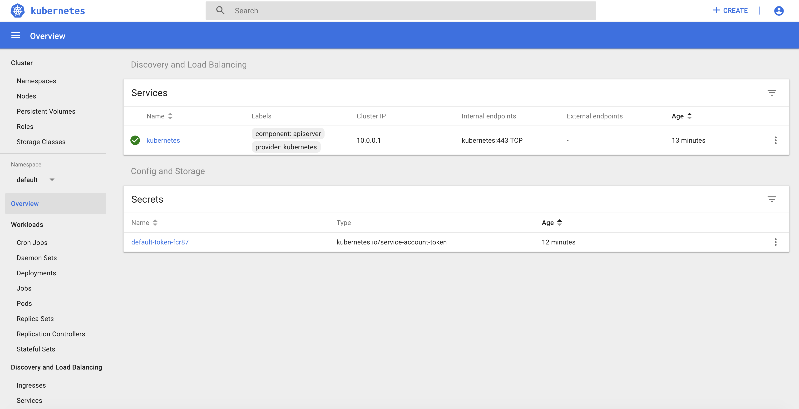

# Konvoy training

## Introduction

During this training, you'll learn how to deploy Konvoy and to use its main features:

* [Introduction](#introduction)
* [Prerequisites](#prerequisites)
* [1. Deploy a Konvoy cluster](#1-deploy-a-konvoy-cluster)
* [2. Leverage persistent storage using CSI](#5-leverage-persistent-storage-using-csi)
* [3. Deploy portworx for persistent storage](#1-deploy-portworx)
* [4. Deploy Jenkins using Helm](#6-deploy-jenkins-using-helm)
* [5. Deploy Apache Kafka using KUDO](#7-deploy-apache-kafka-using-kudo)


## Prerequisites

You need either a Linux, MacOS or a Windows laptop.


## Jumpserver

Jumpservers have been deployed for each student with all prerequisites installed. First, go to the student data spreadsheet and select a host by entering your name.  Then, download the ssh-private-key (id_rsa_student#) and change the file permissions.  Finally, ssh to the ipaddress of your assigned jumpserver using the -i option to specify the identity file to be used.  The username for the Jumpserver is "centos".

For Mac and Linux clients you must change the permission on the file.
```
chmod 400 id_rsa_student#
```
```
ssh -i id_rsa_student# centos@jumpserver-ip-address
```


>For Windows, you need to use the [Google Cloud Shell](https://console.cloud.google.com/cloudshell).
Once your Google Cloud Shell has started, you will have to copy the contents of you id_rsa_student#.pem file to a local file in the cloud shell.  Then change the permission on the file and ssh into the jump host.


```
vi id_rsa_student#
```
```
chmod 400 id_rsa_student#
```
```
ssh -i id_rsa_student# centos@jumpserver-ip-address
```

## 1. Deploy a Konvoy cluster

### Objectives
- Deploy a Kubernetes cluster with all the addons you need to get a production ready container orchestration platform
- Configure kubectl to manage your cluster

### Why is this Important?
There are many ways to deploy a kubernetes cluster from a fully manual procedure to using a fully automated or opinionated SaaS. Cluster sizes can also widely vary from a single node deployment on your laptop, to thousands of nodes in a single logical cluster, or even across multiple clusters. Thus, picking a deployment model that suits the scale that you need as your business grows is important.


Change directories into the lab directory:

```
cd ~/lab
```

Deploy your cluster using the command below:

```bash
konvoy up --yes
```

The output should be similar to:

```                                                                
This process will take about 15 minutes to complete (additional time may be required for larger clusters), do you want to continue [y/n]: y

STAGE [Provisioning Infrastructure]

Initializing provider plugins...

...

Terraform has been successfully initialized!

...

STAGE [Deploying Enabled Addons]
helm                                                                   [OK]
dashboard                                                              [OK]
fluentbit                                                              [OK]
awsebscsiprovisioner                                                   [OK]
traefik                                                                [OK]
opsportal                                                              [OK]
kommander                                                              [OK]
prometheus                                                             [OK]
elasticsearch                                                          [OK]
dex                                                                    [OK]
elasticsearchexporter                                                  [OK]
kibana                                                                 [OK]
traefik-forward-auth                                                   [OK]
prometheusadapter                                                      [OK]
dex-k8s-authenticator                                                  [OK]
velero                                                                 [OK]

STAGE [Removing Disabled Addons]

Kubernetes cluster and addons deployed successfully!

Run `konvoy apply kubeconfig` to update kubectl credentials.

Navigate to the URL below to access various services running in the cluster.
  https://a7e039f1a05a54f45b36e063f5aee077-287582892.us-west-2.elb.amazonaws.com/ops/landing
And login using the credentials below.
  Username: goofy_einstein
  Password: tUeARRKxM8PfrIy2cjFc1jI0Hr2I0duzlttr1LzRTKoDooQJ0d1yyutjNv4NLHvy

If the cluster was recently created, the dashboard and services may take a few minutes to be accessible.
```

If you get any error during the deployment of the addons (it can happen with network connectivity issues), then, you can run the following command to redeploy them:

```
konvoy deploy addons --yes
```

As soon as your cluster is successfully deployed, the URL and the credentials to access your cluster are displayed. When you lauch your dashboard URL in your browser the first screen will ask you to select "login or generate token", select login and use the credentials provided.

If you need to get this information later, you can execute the command below:
```bash
konvoy get ops-portal
```


Click on the `Kubernetes Dashboard` icon to open it.



To configure kubectl to manage your cluster, you simply need to run the following command:

```
konvoy apply kubeconfig
```

You can check that the Kubernetes cluster has been deployed using the version `1.15.2` with 3 control nodes and 5 workers nodes

```bash
kubectl get nodes
```
The output should be similar to:
```bash
NAME                                         STATUS   ROLES    AGE   VERSION
ip-10-0-128-64.us-west-2.compute.internal    Ready    <none>   10m   v1.15.2
ip-10-0-129-247.us-west-2.compute.internal   Ready    <none>   10m   v1.15.2
ip-10-0-129-41.us-west-2.compute.internal    Ready    <none>   10m   v1.15.2
ip-10-0-129-88.us-west-2.compute.internal    Ready    <none>   10m   v1.15.2
ip-10-0-130-84.us-west-2.compute.internal    Ready    <none>   10m   v1.15.2
ip-10-0-193-118.us-west-2.compute.internal   Ready    master   11m   v1.15.2
ip-10-0-193-232.us-west-2.compute.internal   Ready    master   12m   v1.15.2
ip-10-0-194-21.us-west-2.compute.internal    Ready    master   13m   v1.15.2
```

## 2. Leverage persistent storage using CSI

### Objectives
- Create a PersistentVolumeClaim (pvc) to use the AWS EBS CSI driver
- Create a service that will use this PVC and dynamically provision an EBS volume
- Validate persistence

### Why is this Important?
The goal of CSI is to establish a standardized mechanism for Container Orchestration Systems to expose arbitrary storage systems to their containerized workloads. The CSI specification emerged from cooperation between community members from various Container Orchestration Systems including Kubernetes, Mesos, Docker, and Cloud Foundry.

By creating an industry standard interface, the CSI initiative sets ground rules in order to minimize user confusion. By providing a pluggable standardized interface, the community will be able to adopt and maintain new CSI-enabled storage drivers to their kubernetes clusters as they mature. Choosing a solution that supports CSI integration will allow your business to adopt the latest and greatest storage solutions with ease.

When Konvoy is deployed on AWS, a `StorageClass` is created automatically as you can see below:

```
kubectl get sc awsebscsiprovisioner -o yaml
```

The output should be similar to:
```bash
apiVersion: storage.k8s.io/v1
kind: StorageClass
metadata:
  annotations:
    kubernetes.io/description: AWS EBS CSI provisioner StorageClass
    storageclass.kubernetes.io/is-default-class: "true"
  creationTimestamp: "2019-08-12T10:43:23Z"
  name: awsebscsiprovisioner
  resourceVersion: "1573"
  selfLink: /apis/storage.k8s.io/v1/storageclasses/awsebscsiprovisioner
  uid: 413745a0-ec52-4917-afb5-70bdf8f2a606
parameters:
  type: gp2
provisioner: ebs.csi.aws.com
reclaimPolicy: Delete
volumeBindingMode: WaitForFirstConsumer
```

Create the Kubernetes PersistentVolumeClaim using the following command:

```bash
cat <<EOF | kubectl create -f -
apiVersion: v1
kind: PersistentVolumeClaim
metadata:
  name: dynamic
spec:
  accessModes:
    - ReadWriteOnce
  storageClassName: awsebscsiprovisioner
  resources:
    requests:
      storage: 1Gi
EOF
```

Run the following command to check the status of the `PersistentVolumeClaim`:

```bash
kubectl describe pvc dynamic
```

The output should be similar to:
```bash
Name:          dynamic
Namespace:     default
StorageClass:  awsebscsiprovisioner
Status:        Pending
Volume:        
Labels:        <none>
Annotations:   <none>
Finalizers:    [kubernetes.io/pvc-protection]
Capacity:      
Access Modes:  
VolumeMode:    Filesystem
Events:
  Type       Reason                Age               From                         Message
  ----       ------                ----              ----                         -------
  Normal     WaitForFirstConsumer  3s (x3 over 21s)  persistentvolume-controller  waiting for first consumer to be created before binding
Mounted By:  <none>
```

As you can see, it is waiting for a `Pod` to use it to provision the AWS EBS volume.

Create a Kubernetes Deployment that will use this `PersistentVolumeClaim` using the following command:

```bash
cat <<EOF | kubectl create -f -
apiVersion: apps/v1
kind: Deployment
metadata:
  name: ebs-dynamic-app
  labels:
    app: ebs-dynamic-app
spec:
  replicas: 1
  selector:
    matchLabels:
      app: ebs-dynamic-app
  template:
    metadata:
      labels:
        app: ebs-dynamic-app
    spec:
      containers:
      - name: ebs-dynamic-app
        image: centos:7
        command: ["/bin/sh"]
        args: ["-c", "while true; do echo \$(date -u) >> /data/out.txt; sleep 5; done"]
        volumeMounts:
        - name: persistent-storage
          mountPath: /data
      volumes:
      - name: persistent-storage
        persistentVolumeClaim:
          claimName: dynamic
EOF
```

Run the following command until the pod is running:

```bash
kubectl get pods
```

Check the content of the file `/data/out.txt` and note the first timestamp:

```bash
pod=$(kubectl get pods | grep ebs-dynamic-app | awk '{ print $1 }')
kubectl exec -i $pod cat /data/out.txt
```

Delete the Pod using the following command (it will take some time to complete):

```bash
kubectl delete pod $pod
```

The Deployment will recreate the pod automatically.

Run the following command until the pod is running:

```bash
kubectl get pods
```

Check the content of the file `/data/out.txt` and verify that the first timestamp is the same as the one noted previously:

```bash
pod=$(kubectl get pods | grep ebs-dynamic-app | awk '{ print $1 }')
kubectl exec -i $pod cat /data/out.txt
```


## 3. Portworx
#### Leverage persistent storage using Portworx

Portworx is a Software Defined Software that can use the local storage of the DC/OS nodes to provide High Available persistent storage to both Kubernetes pods and DC/OS services.

### Objectives
- Deploy Portworx on your Kubernetes cluster to leverage persistent storage using a kubernetes StorageClass
- Create a PersistentVolumeClaim (pvc) to use volumes created in Portworx
- Create a Pod service that will consume this pvc, write data to the persistent volume, and delete the Pod
- Create a second Pod service that will consume the same pvc and validate that data persisted

### Why is this Important?
In recent years, containerization has become a popular way to bundle applications in a way that can be created and destroyed as often as needed. However, initially the containerization space did not support persistent storage, meaning that the data created within a container would disappear when the app finished its work and the container was destroyed. For many use-cases this is undesirable, and the industry has met the need by providing methods of retaining data created by storing them in persistent volumes. This allows for stateful applications such as databases to remain available even if a container goes down.

Mesosphere provides multiple ways to achieving persistent storage for containerized applications. Portworx has been a partner of Mesosphere for many years and is a leading solution for container-based storage on the market. The Portworx solution is well integrated with Konvoy and the Kubernetes community.

Set the following environment variables:

```bash
export CLUSTER=$(grep -m 1 tags.kubernetes.io/cluster state/terraform.tfstate | awk '{ print $2 }' | cut -d\" -f2)
export REGION=us-west-2
```

Execute the following commands to create and attach an EBS volume to each Kubelet.

```bash
aws --region="$REGION" ec2 describe-instances |  jq --raw-output ".Reservations[].Instances[] | select((.Tags | length) > 0) | select(.Tags[].Value | test(\"$CLUSTER-worker\")) | select(.State.Name | test(\"running\")) | [.InstanceId, .Placement.AvailabilityZone] | \"\(.[0]) \(.[1])\"" | while read -r instance zone; do
  echo "$instance" "$zone"
  volume=$(aws --region="$REGION" ec2 create-volume --size=100  --availability-zone="$zone" --tag-specifications="ResourceType=volume,Tags=[{Key=string,Value=$CLUSTER}]" | jq --raw-output .VolumeId)
  sleep 10
  aws --region=$REGION ec2 attach-volume --device=/dev/xvdc --instance-id="$instance" --volume-id="$volume"
done
```

To be able to use Portworx persistent storage on your Kubernetes cluster, you need to download the Portworx specs using the following command:

```bash
wget -O portworx.yaml "https://install.portworx.com/?mc=false&kbver=1.15.1&b=true&stork=true&lh=true&st=k8s&c=cluster1"
```

Then, you need to edit the `portworx.yaml` file to modify the type of the Kubernetes Service from `NodePort` to `LoadBalancer`:

```
apiVersion: v1
kind: Service
metadata:
  name: px-lighthouse
  namespace: kube-system
  labels:
    tier: px-web-console
spec:
  type: LoadBalancer
  ports:
    - name: http
      port: 80
      targetPort: 80
    - name: https
      port: 443
      targetPort: https
  selector:
    tier: px-web-console
```

Now, you can deploy Portworx using the command below:

```bash
kubectl apply -f portworx.yaml
```

Run the following command until all the pods are running:

```bash
kubectl -n kube-system get pods
```

You need to wait for a few minutes while the Load Balancer is created on AWS and the name resolution in place.

```bash
until nslookup $(kubectl -n kube-system get svc px-lighthouse --output jsonpath={.status.loadBalancer.ingress[*].hostname})
do
  sleep 5
done
echo "Open http://$(kubectl -n kube-system get svc px-lighthouse --output jsonpath={.status.loadBalancer.ingress[*].hostname}) to access the Portworx UI"
```

Access the Portworx UI using the URL indicated and login with the user `admin` and the password `Password1`.


Create the Kubernetes StorageClass using the following command:

```bash
cat <<EOF | kubectl create -f -
kind: StorageClass
apiVersion: storage.k8s.io/v1beta1
metadata:
   name: portworx-sc
provisioner: kubernetes.io/portworx-volume
parameters:
  repl: "2"
EOF
```

It will create volumes on Portworx with 2 replicas.

Create the Kubernetes PersistentVolumeClaim using the following command:

```bash
cat <<EOF | kubectl create -f -
kind: PersistentVolumeClaim
apiVersion: v1
metadata:
  name: pvc001
  annotations:
    volume.beta.kubernetes.io/storage-class: portworx-sc
spec:
  accessModes:
    - ReadWriteOnce
  storageClassName: portworx-sc
  resources:
    requests:
      storage: 1Gi
EOF
```

Check the status of the PersistentVolumeClaim using the following command:

```bash
kubectl describe pvc pvc001
Name:          pvc001
Namespace:     default
StorageClass:  portworx-sc
Status:        Bound
Volume:        pvc-a38e5d2c-7df9-11e9-b547-0ac418899022
Labels:        <none>
Annotations:   pv.kubernetes.io/bind-completed: yes
               pv.kubernetes.io/bound-by-controller: yes
               volume.beta.kubernetes.io/storage-class: portworx-sc
               volume.beta.kubernetes.io/storage-provisioner: kubernetes.io/portworx-volume
Finalizers:    [kubernetes.io/pvc-protection]
Capacity:      1Gi
Access Modes:  RWO
VolumeMode:    Filesystem
Events:
  Type       Reason                 Age   From                         Message
  ----       ------                 ----  ----                         -------
  Normal     ProvisioningSucceeded  12s   persistentvolume-controller  Successfully provisioned volume pvc-a38e5d2c-7df9-11e9-b547-0ac418899022 using kubernetes.io/portworx-volume
Mounted By:  <none>
```

Create a Kubernetes Pod that will use this PersistentVolumeClaim using the following command:

```bash
cat <<EOF | kubectl create -f -
apiVersion: v1
kind: Pod
metadata:
  name: pvpod
spec:
  containers:
  - name: test-container
    image: alpine:latest
    command: [ "/bin/sh" ]
    args: [ "-c", "while true; do sleep 60;done" ]
    volumeMounts:
    - name: test-volume
      mountPath: /test-portworx-volume
  volumes:
  - name: test-volume
    persistentVolumeClaim:
      claimName: pvc001
EOF
```

Create a file in the Volume using the following commands:

```bash
kubectl exec -i pvpod -- /bin/sh -c "echo test > /test-portworx-volume/test"
```

Delete the Pod using the following command:

```bash
kubectl delete pod pvpod
```

Create a Kubernetes Pod that will use the same PersistentVolumeClaim using the following command:

```bash
cat <<EOF | kubectl create -f -
apiVersion: v1
kind: Pod
metadata:
  name: pvpod
spec:
  containers:
  - name: test-container
    image: alpine:latest
    command: [ "/bin/sh" ]
    args: [ "-c", "while true; do sleep 60;done" ]
    volumeMounts:
    - name: test-volume
      mountPath: /test-portworx-volume
  volumes:
  - name: test-volume
    persistentVolumeClaim:
      claimName: pvc001
EOF
```

Validate that the file created in the previous Pod is still available:

```bash
kubectl exec -i pvpod cat /test-portworx-volume/test
```


## 4. Deploy Jenkins using Helm

Helm is a tool for managing Kubernetes charts. Charts are packages of pre-configured Kubernetes resources.

You can find many charts on the [Helm Hub](https://hub.helm.sh/).

In this lab, we'll deploy the [Jenkins Helm chart](https://hub.helm.sh/charts/stable/jenkins).


Initialize helm client on your workstation:

```bash
helm init
```
To deploy the chart, you need to run the following command:
```bash
helm install stable/jenkins --name jenkins --version 1.5.0 --set master.adminPassword=password
```

The output should be similar to:
```bash
NAME:   jenkins
LAST DEPLOYED: Wed Aug  7 17:21:32 2019
NAMESPACE: default
STATUS: DEPLOYED

RESOURCES:
==> v1/ConfigMap
NAME           DATA  AGE
jenkins        5     1s
jenkins-tests  1     1s

==> v1/Deployment
NAME     READY  UP-TO-DATE  AVAILABLE  AGE
jenkins  0/1    1           0          1s

==> v1/PersistentVolumeClaim
NAME     STATUS   VOLUME                CAPACITY  ACCESS MODES  STORAGECLASS  AGE
jenkins  Pending  awsebscsiprovisioner  1s

==> v1/Pod(related)
NAME                     READY  STATUS   RESTARTS  AGE
jenkins-c79f457cb-ccttb  0/1    Pending  0         1s

==> v1/Role
NAME                     AGE
jenkins-schedule-agents  1s

==> v1/RoleBinding
NAME                     AGE
jenkins-schedule-agents  1s

==> v1/Secret
NAME     TYPE    DATA  AGE
jenkins  Opaque  2     1s

==> v1/Service
NAME           TYPE          CLUSTER-IP  EXTERNAL-IP  PORT(S)         AGE
jenkins        LoadBalancer  10.0.9.26   <pending>    8080:30323/TCP  1s
jenkins-agent  ClusterIP     10.0.41.64  <none>       50000/TCP       1s

==> v1/ServiceAccount
NAME     SECRETS  AGE
jenkins  1        1s
```

Then, run the following command to get the URL of the Load Balancer created on AWS for this service:

```bash
kubectl get svc jenkins
```

The output should be similar to:
```bash
NAME      TYPE           CLUSTER-IP   EXTERNAL-IP                                                              PORT(S)          AGE
jenkins   LoadBalancer   10.0.9.26    a71b8025991124a90b2babf7ba2a75da-492974167.us-west-2.elb.amazonaws.com   8080:30323/TCP   16m
```

You need to wait for a few minutes while the Load Balancer is created on AWS and the name resolution in place.

```bash
until nslookup $(kubectl get svc jenkins --output jsonpath={.status.loadBalancer.ingress[*].hostname})
do
  sleep 5
done
echo "Open http://$(kubectl get svc jenkins --output jsonpath={.status.loadBalancer.ingress[*].hostname}):8080 to access the Jenkins UI"
```

Go to the URL displayed to access Jenkins.

Login with the user `admin` and the password `password`.

## 5. Deploy Apache Kafka using KUDO

The Kubernetes Universal Declarative Operator (KUDO) is a highly productive toolkit for writing operators for Kubernetes. Using KUDO, you can deploy your applications, give your users the tools they need to operate it, and understand how it's behaving in their environments — all without a PhD in Kubernetes.


Install the KUDO CLI (on Linux):

```bash
wget https://github.com/kudobuilder/kudo/releases/download/v0.8.0/kubectl-kudo_0.8.0_linux_x86_64
sudo mv kubectl-kudo_0.8.0_linux_x86_64 /usr/local/bin/kubectl-kudo
chmod +x /usr/local/bin/kubectl-kudo
```

Run the following commands to deploy KUDO on your Kubernetes cluster:

```bash
kubectl kudo init
```

The output should be similar to:
```bash

$KUDO_HOME has been configured at /home/centos/.kudo.
```

Check the status of the KUDO controller:

```bash
kubectl get pods -n kudo-system
```

The output should be similar to:
```bash
NAME                        READY   STATUS    RESTARTS   AGE
kudo-controller-manager-0   1/1     Running   0          84s
```

Deploy ZooKeeper using KUDO:

```bash
kubectl kudo install zookeeper --instance=zk
```

The output should be similar to:
```bash
operator.kudo.dev/v1beta1/zookeeper created
operatorversion.kudo.dev/v1beta1/zookeeper-0.2.0 created
instance.kudo.dev/v1beta1/zk created
```

Check the status of the deployment:

```bash
kubectl kudo plan status --instance=zk
```

The output should be similar to:
```bash
Plan(s) for "zk" in namespace "default":
.
└── zk (Operator-Version: "zookeeper-0.2.0" Active-Plan: "deploy")
    ├── Plan deploy (serial strategy) [COMPLETE]
    │   ├── Phase zookeeper [COMPLETE]
    │   │   └── Step deploy (COMPLETE)
    │   └── Phase validation [COMPLETE]
    │       ├── Step validation (COMPLETE)
    │       └── Step cleanup (COMPLETE)
    └── Plan validation (serial strategy) [NOT ACTIVE]
        └── Phase connection (serial strategy) [NOT ACTIVE]
            └── Step connection (serial strategy) [NOT ACTIVE]
                ├── connection [NOT ACTIVE]
                └── cleanup [NOT ACTIVE]
```

And check that the corresponding Pods are running:

```bash
kubectl get pods | grep zk
```

The output should be similar to:
```bash
zk-zookeeper-0                         1/1     Running   0          21m
zk-zookeeper-1                         1/1     Running   0          21m
zk-zookeeper-2                         1/1     Running   0          21m
```

Deploy Kafka 2.2.1 using KUDO (the version of the KUDO Kafka operator is 0.1.3):

```bash
kubectl kudo install kafka --instance=kafka -p ZOOKEEPER_URI=zk-zookeeper-0.zk-hs:2181,zk-zookeeper-1.zk-hs:2181,zk-zookeeper-2.zk-hs:2181 --version=0.1.3
```

Check the status of the deployment:

```bash
kubectl kudo plan status --instance=kafka
```

The output should be similar to:
```bash
Plan(s) for "kafka" in namespace "default":
.
└── kafka (Operator-Version: "kafka-0.1.3" Active-Plan: "deploy")
    ├── Plan deploy (serial strategy) [COMPLETE]
    │   └── Phase deploy-kafka [COMPLETE]
    │       └── Step deploy (COMPLETE)
    └── Plan not-allowed (serial strategy) [NOT ACTIVE]
        └── Phase not-allowed (serial strategy) [NOT ACTIVE]
            └── Step not-allowed (serial strategy) [NOT ACTIVE]
                └── not-allowed [NOT ACTIVE]
```

And check that the corresponding Pods are running:

```bash
kubectl get pods | grep kafka
```

The output should be similar to:
```bash
kafka-kafka-0                          1/1     Running   0          39s
kafka-kafka-1                          1/1     Running   0          58s
kafka-kafka-2                          1/1     Running   0          118s
```

Produce messages in Kafka:

```bash
cat <<EOF | kubectl create -f -
apiVersion: apps/v1beta1
kind: Deployment
metadata:
  name: kudo-kafka-generator
spec:
  replicas: 1
  template:
    metadata:
      name: kudo-kafka-generator
      labels:
        app: kudo-kafka-generator
    spec:
      containers:
      - name: kudo-kafka-generator
        image: mesosphere/flink-generator:0.1
        command: ["/generator-linux"]
        imagePullPolicy: Always
        args: ["--broker", "kafka-kafka-0.kafka-svc:9092"]
EOF
```

Consume messages from Kafka:

```bash
cat <<EOF | kubectl create -f -
apiVersion: apps/v1beta1
kind: Deployment
metadata:
 name: kudo-kafka-consumer
spec:
 replicas: 1
 template:
   metadata:
     name: kudo-kafka-consumer
     labels:
       app: kudo-kafka-consumer
   spec:
     containers:
     - name: kudo-kafka-consumer
       image: tbaums/kudo-kafka-demo
       imagePullPolicy: Always
       env:
        - name: BROKER_SERVICE
          value: kafka-kafka-0.kafka-svc:9092
EOF
```

Check the logs:

```bash
kubectl logs $(kubectl get pods -l app=kudo-kafka-consumer -o jsonpath='{.items[0].metadata.name}') --follow
```

The output should be similar to:
```bash
Message: b'2019-11-12T12:23:19Z;3;4;1071'
Message: b'2019-11-12T12:23:21Z;4;3;3095'
Message: b'2019-11-12T12:23:22Z;3;7;8639'
Message: b'2019-11-12T12:23:27Z;9;4;7861'
Message: b'2019-11-12T12:23:30Z;7;5;3594'
Message: b'2019-11-12T12:23:33Z;5;0;9985'
```

KUDO is creating CRDs (new objects) in Kubernetes and you can get information about these objects like you can get informations about pods, deployments, ...

Run this command to get the list of CRDs created by KUDO:

```bash
kubectl get crds | grep kudo
```

The output should be similar to:
```bash
instances.kudo.dev                               2019-11-12T12:16:19Z
operators.kudo.dev                               2019-11-12T12:16:19Z
operatorversions.kudo.dev                        2019-11-12T12:16:19Z
```

Now list the KUDO instances running using the following command:

```bash
kubectl get instances.kudo.dev
```

The output should be similar to:
```bash
NAME    AGE
kafka   18m
zk      33m
```

And get information about the KUDO Kafka instance:

```bash
kubectl get instances.kudo.dev kafka -o yaml
```

The output should be similar to:
```bash
apiVersion: kudo.dev/v1beta1
kind: Instance
metadata:
  annotations:
    kudo.dev/last-applied-instance-state: '{"operatorVersion":{"name":"kafka-0.1.3"},"parameters":{"ZOOKEEPER_URI":"zk-zookeeper-0.zk-hs:2181,zk-zookeeper-1.zk-hs:2181,zk-zookeeper-2.zk-hs:2181"}}'
  creationTimestamp: "2019-11-12T12:46:39Z"
  generation: 3
  labels:
    controller-tools.k8s.io: "1.0"
    kudo.dev/operator: kafka
  name: kafka
  namespace: default
  resourceVersion: "81847"
  selfLink: /apis/kudo.dev/v1beta1/namespaces/default/instances/kafka
  uid: 6f289e56-86e7-40d2-8360-f8255678a801
spec:
  operatorVersion:
    name: kafka-0.1.3
  parameters:
    ZOOKEEPER_URI: zk-zookeeper-0.zk-hs:2181,zk-zookeeper-1.zk-hs:2181,zk-zookeeper-2.zk-hs:2181
status:
  aggregatedStatus:
    status: COMPLETE
  planStatus:
    deploy:
      lastFinishedRun: "2019-11-12T12:47:57Z"
      name: deploy
      phases:
      - name: deploy-kafka
        status: COMPLETE
        steps:
        - name: deploy
          status: COMPLETE
      status: COMPLETE
      uid: e0ba11bf-d2d5-467b-b96c-c443aa0ba5ef
    not-allowed:
      lastFinishedRun: null
      name: not-allowed
      phases:
      - name: not-allowed
        status: NEVER_RUN
        steps:
        - name: not-allowed
          status: NEVER_RUN
      status: NEVER_RUN
```

This is also the approach you take to delete a running instance (`kubectl delete instances.kudo.dev kafka`), but you can keep it running.

Upgrade your Kafka cluster to 2.3.0 (the version of the KUDO Kafka operator is 1.0.0) using the following command:

```bash
kubectl kudo upgrade kafka --version=1.0.0 --instance kafka
```

The output should be similar to:
```bash
instance./kafka updated
```

Check the status of the upgrade:

```bash
kubectl kudo plan status --instance=kafka
```

The output should be similar to:
```bash
Plan(s) for "kafka" in namespace "default":
.
└── kafka (Operator-Version: "kafka-1.0.0" Active-Plan: "deploy")
    ├── Plan deploy (serial strategy) [COMPLETE]
    │   └── Phase deploy-kafka [COMPLETE]
    │       └── Step deploy (COMPLETE)
    └── Plan not-allowed (serial strategy) [NOT ACTIVE]
        └── Phase not-allowed (serial strategy) [NOT ACTIVE]
            └── Step not-allowed (serial strategy) [NOT ACTIVE]
                └── not-allowed [NOT ACTIVE]
```

And get information about the upgraded KUDO Kafka instance:

```bash
kubectl get instances.kudo.dev kafka -o yaml
```

The output should be similar to:
```bash
apiVersion: kudo.dev/v1beta1
kind: Instance
metadata:
  annotations:
    kudo.dev/last-applied-instance-state: '{"operatorVersion":{"name":"kafka-1.0.0"},"parameters":{"ZOOKEEPER_URI":"zk-zookeeper-0.zk-hs:2181,zk-zookeeper-1.zk-hs:2181,zk-zookeeper-2.zk-hs:2181"}}'
  creationTimestamp: "2019-11-12T12:46:39Z"
  generation: 6
  labels:
    controller-tools.k8s.io: "1.0"
    kudo.dev/operator: kafka
  name: kafka
  namespace: default
  resourceVersion: "82826"
  selfLink: /apis/kudo.dev/v1beta1/namespaces/default/instances/kafka
  uid: 6f289e56-86e7-40d2-8360-f8255678a801
spec:
  operatorVersion:
    name: kafka-1.0.0
  parameters:
    ZOOKEEPER_URI: zk-zookeeper-0.zk-hs:2181,zk-zookeeper-1.zk-hs:2181,zk-zookeeper-2.zk-hs:2181
status:
  aggregatedStatus:
    status: COMPLETE
  planStatus:
    deploy:
      lastFinishedRun: "2019-11-12T12:51:03Z"
      name: deploy
      phases:
      - name: deploy-kafka
        status: COMPLETE
        steps:
        - name: deploy
          status: COMPLETE
      status: COMPLETE
      uid: 6d4016db-71d2-42dc-a8b1-0a0473f84881
    not-allowed:
      lastFinishedRun: null
      name: not-allowed
      phases:
      - name: not-allowed
        status: NEVER_RUN
        steps:
        - name: not-allowed
          status: NEVER_RUN
      status: NEVER_RUN
```

And check that the corresponding Pods have been replaced:

```bash
kubectl get pods | grep kafka
```

The output should be similar to:
```bash
kafka-kafka-0                          1/1     Running   0          77s
kafka-kafka-1                          1/1     Running   0          100s
kafka-kafka-2                          1/1     Running   0          2m20s
kudo-kafka-consumer-6b4dd5cd59-r7svb   1/1     Running   0          28m
kudo-kafka-generator-d655d6dff-5pztl   1/1     Running   0          28m
```

You can also easily update the configuration of your Kafka cluster.

For example, you can add more brokers using the command below.

```bash
kubectl patch instance kafka -p '{"spec":{"parameters":{"BROKER_COUNT":"5"}}}' --type=merge
```

The output should be similar to:
```bash
instance.kudo.dev/kafka patched
```

Check the status of the upgrade:

```bash
kubectl kudo plan status --instance=kafka
```

The output should be similar to:
```bash
Plan(s) for "kafka" in namespace "default":
.
└── kafka (Operator-Version: "kafka-1.0.0" Active-Plan: "deploy")
    ├── Plan deploy (serial strategy) [COMPLETE]
    │   └── Phase deploy-kafka [COMPLETE]
    │       └── Step deploy (COMPLETE)
    └── Plan not-allowed (serial strategy) [NOT ACTIVE]
        └── Phase not-allowed (serial strategy) [NOT ACTIVE]
            └── Step not-allowed (serial strategy) [NOT ACTIVE]
                └── not-allowed [NOT ACTIVE]
```

And check that the corresponding Pods are running:

```bash
kubectl get pods | grep kafka
```

The output should be similar to:
```bash
kafka-kafka-0                          1/1     Running   0          70s
kafka-kafka-1                          1/1     Running   0          102s
kafka-kafka-2                          1/1     Running   0          2m35s
kafka-kafka-3                          1/1     Running   0          3m44s
kafka-kafka-4                          1/1     Running   0          3m15s
kudo-kafka-consumer-6b4dd5cd59-r7svb   1/1     Running   0          33m
kudo-kafka-generator-d655d6dff-5pztl   1/1     Running   0          33m
```
