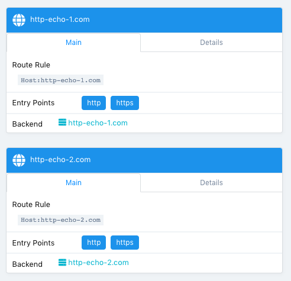
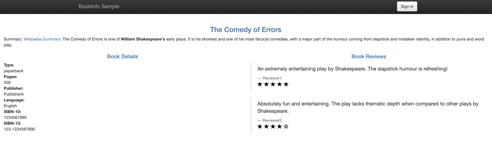

# Konvoy training

## Introduction

During this training, you'll learn how to deploy Konvoy and to use its main features:

* [Introduction](#introduction)
* [Prerequisites](#prerequisites)
* [1. Do a Health check the k8s cluster](#1-deploy-a-konvoy-cluster)
* [2. Expose a Kubernetes Application using a Service Type Load Balancer (L4)](#2-expose-a-kubernetes-application-using-a-service-type-load-balancer-l4)
* [3. Expose a Kubernetes Application using an Ingress (L7)](#3-expose-a-kubernetes-application-using-an-ingress-l7)
* [4. Leverage Network Policies to restrict access](#4-leverage-network-policies-to-restrict-access)
* [5. Deploy Istio on Konvoy](#5-Deploy-Istio-on-Konvoy)
* [6. Deploy Bookinfo Application](#6-Deploy-Bookinfo-Application)
* [7. Istio-Traffic-Management](#7-Istio-traffic-management)


## Prerequisites

You need either a Linux, MacOS or a Windows laptop.


## Jumpserver

Jumpservers have been deployed for each student with all prerequisites installed. First, go to the student data spreadsheet and select a host by entering your name.  Then, download the ssh-private-key (id_rsa_student#) and change the file permissions.  Finally, ssh to the ipaddress of your assigned jumpserver using the -i option to specify the identity file to be used.  The username for the Jumpserver is "centos".

For Mac and Linux clients you must change the permission on the file.
```
chmod 400 id_rsa_student#
```
```
ssh -i id_rsa_student# centos@jumpserver-ip-address
```


>For Windows, you need to use the [Google Cloud Shell](https://console.cloud.google.com/cloudshell).
Once your Google Cloud Shell has started, you will have to copy the contents of you id_rsa_student#.pem file to a local file in the cloud shell.  Then change the permission on the file and ssh into the jump host.


```
vi id_rsa_student#
```
```
chmod 400 id_rsa_student#
```
```
ssh -i id_rsa_student# centos@jumpserver-ip-address
```

## 1. Health Check Konvoy cluster

### Objectives
- Deploy a Kubernetes cluster with all the addons you need to get a production ready container orchestration platform
- Configure kubectl to manage your cluster

### Why is this Important?
There are many ways to deploy a kubernetes cluster from a fully manual procedure to using a fully automated or opinionated SaaS. Cluster sizes can also widely vary from a single node deployment on your laptop, to thousands of nodes in a single logical cluster, or even across multiple clusters. Thus, picking a deployment model that suits the scale that you need as your business grows is important.


Change directories into the lab directory:

```
cd ~/lab
```

Deploy your cluster using the command below:

```bash
konvoy check 
```

The output should be similar to:

```                                                                
This process will take about 2-3 minutes to complete (additional time may be required for larger clusters), do you want to continue [y/n]: y

STAGE [Provisioning Infrastructure]

Initializing provider plugins...

...

Terraform has been successfully initialized!

...

STAGE [Checking Addons]
elasticsearch                                                          [OK]
gatekeeper                                                             [OK]
reloader                                                               [OK]
cert-manager                                                           [OK]
elasticsearchexporter                                                  [OK]
konvoyconfig                                                           [OK]
opsportal                                                              [OK]
external-dns                                                           [OK]
prometheus                                                             [OK]
dashboard                                                              [OK]
dex                                                                    [OK]
kommander                                                              [OK]
kudo                                                                   [OK]
traefik                                                                [OK]
fluentbit                                                              [OK]
kibana                                                                 [OK]
prometheusadapter                                                      [OK]
traefik-forward-auth                                                   [OK]
awsebscsiprovisioner                                                   [OK]
defaultstorageclass-protection                                         [OK]
dex-k8s-authenticator                                                  [OK]
velero                                                                 [OK]
kube-oidc-proxy                                                        [OK]


# If you did add credentials to kubeconfig file
Run `konvoy apply kubeconfig` to update kubectl credentials.

Navigate to the URL below to access various services running in the cluster.
  https://a7e039f1a05a54f45b36e063f5aee077-287582892.us-west-2.elb.amazonaws.com/ops/landing
And login using the credentials below.
  Username: goofy_einstein
  Password: tUeARRKxM8PfrIy2cjFc1jI0Hr2I0duzlttr1LzRTKoDooQJ0d1yyutjNv4NLHvy

If the cluster was recently created, the dashboard and services may take a few minutes to be accessible.
```

If you get any error during the deployment of the addons (it can happen with network connectivity issues), then, you can run the following command to redeploy them:

```
konvoy deploy addons --yes
```

As soon as your cluster is successfully deployed, the URL and the credentials to access your cluster are displayed. When you lauch your dashboard URL in your browser the first screen will ask you to select "login or generate token", select login and use the credentials provided.

If you need to get this information later, you can execute the command below:
```bash
konvoy get ops-portal
```


Click on the `Kubernetes Dashboard` icon to open it.


You can check that the Kubernetes cluster has been deployed using the version `1.15.2` with 3 control nodes and 5 workers nodes

```bash
kubectl get nodes
```
The output should be similar to:
```bash
NAME                                         STATUS   ROLES    AGE   VERSION
ip-10-0-128-64.us-west-2.compute.internal    Ready    <none>   10m   v1.15.2
ip-10-0-129-247.us-west-2.compute.internal   Ready    <none>   10m   v1.15.2
ip-10-0-129-41.us-west-2.compute.internal    Ready    <none>   10m   v1.15.2
ip-10-0-129-88.us-west-2.compute.internal    Ready    <none>   10m   v1.15.2
ip-10-0-130-84.us-west-2.compute.internal    Ready    <none>   10m   v1.15.2
ip-10-0-193-118.us-west-2.compute.internal   Ready    master   11m   v1.15.2
ip-10-0-193-232.us-west-2.compute.internal   Ready    master   12m   v1.15.2
ip-10-0-194-21.us-west-2.compute.internal    Ready    master   13m   v1.15.2
```


## 2. Expose a Kubernetes Application using a Service Type Load Balancer (L4)

### Objectives
- Deploy a Redis pod and expose it using a Service Type Load Balancer (L4) and validate that the connection is exposed to the outside
- Deploy a couple hello-world applications and expose them using an Ingress service (L7) and validate that the connection is exposed to the outside

### Why is this Important?
Exposing your application on a kubernetes cluster in an Enterprise-grade environment can be challenging to set up. With Konvoy, the integration with AWS cloud load balancer is already done by default and Traefik is deployed to allow you to easily create Ingresses.

Deploy a redis Pod on your Kubernetes cluster running the following command:

```bash
cat <<EOF | kubectl create -f -
apiVersion: v1
kind: Pod
metadata:
  labels:
    app: redis
  name: redis
spec:
  containers:
  - name: redis
    image: redis:5.0.3
    ports:
    - name: redis
      containerPort: 6379
      protocol: TCP
EOF
```

Then, expose the service, you need to run the following command to create a Service Type Load Balancer:

```bash
cat <<EOF | kubectl create -f -
apiVersion: v1
kind: Service
metadata:
  labels:
    app: redis
  name: redis
spec:
  type: LoadBalancer
  selector:
    app: redis
  ports:
  - protocol: TCP
    port: 6379
    targetPort: 6379
EOF
```

Finally, run the following command to see the URL of the Load Balancer created on AWS for this service:

```bash
kubectl get svc redis

The output should be similar to:
```bash
NAME    TYPE           CLUSTER-IP   EXTERNAL-IP                                                               PORT(S)          AGE
redis   LoadBalancer   10.0.51.32   a92b6c9216ccc11e982140acb7ee21b7-1453813785.us-west-2.elb.amazonaws.com   6379:31423/TCP   43s
```

You need to wait for a few minutes while the Load Balancer is created on AWS and the name resolution in place.

```bash
until nslookup $(kubectl get svc redis --output jsonpath={.status.loadBalancer.ingress[*].hostname})
do
  sleep 1
done
```

You can validate that you can access the redis Pod from your laptop using telnet:

```bash
telnet $(kubectl get svc redis --output jsonpath={.status.loadBalancer.ingress[*].hostname}) 6379
```

The output should be similar to:
```bash
Trying 52.27.218.48...
Connected to a92b6c9216ccc11e982140acb7ee21b7-1453813785.us-west-2.elb.amazonaws.com.
Escape character is '^]'.
quit
+OK
Connection closed by foreign host.
```

If you don't have `telnet` installed in your machine, you can use `nc` instead.

## 3. Expose a Kubernetes Application using an Ingress (L7)

Deploy 2 web application Pods on your Kubernetes cluster running the following command:

```bash
kubectl run --restart=Never --image hashicorp/http-echo --labels app=http-echo-1 --port 80 http-echo-1 -- -listen=:80 --text="Hello from http-echo-1"
kubectl run --restart=Never --image hashicorp/http-echo --labels app=http-echo-2 --port 80 http-echo-2 -- -listen=:80 --text="Hello from http-echo-2"
```

Then, expose the Pods with a Service Type NodePort using the following commands:

```bash
kubectl expose pod http-echo-1 --port 80 --target-port 80 --type NodePort --name "http-echo-1"
kubectl expose pod http-echo-2 --port 80 --target-port 80 --type NodePort --name "http-echo-2"
```

Finally create the Ingress to expose the application to the outside world using the following command:

```bash
cat <<EOF | kubectl create -f -
apiVersion: extensions/v1beta1
kind: Ingress
metadata:
  name: echo
spec:
  rules:
  - host: "http-echo-1.com"
    http:
      paths:
      - backend:
          serviceName: http-echo-1
          servicePort: 80
  - host: "http-echo-2.com"
    http:
      paths:
      - backend:
          serviceName: http-echo-2
          servicePort: 80
EOF
```

Go to the Traefik UI to check that new frontends have been created.



Finally, run the following command to see the URL of the Load Balancer created on AWS for the Traefik service:

```bash
kubectl get svc traefik-kubeaddons -n kubeaddons
```

The output should be similar to:
```bash
NAME                 TYPE           CLUSTER-IP    EXTERNAL-IP                                                             PORT(S)                                     AGE
traefik-kubeaddons   LoadBalancer   10.0.24.215   abf2e5bda6ca811e982140acb7ee21b7-37522315.us-west-2.elb.amazonaws.com   80:31169/TCP,443:32297/TCP,8080:31923/TCP   4h22m
```

You can validate that you can access the web application Pods from your laptop using the following commands:

```bash
curl -k -H "Host: http-echo-1.com" https://$(kubectl get svc traefik-kubeaddons -n kubeaddons --output jsonpath={.status.loadBalancer.ingress[*].hostname})
curl -k -H "Host: http-echo-2.com" https://$(kubectl get svc traefik-kubeaddons -n kubeaddons --output jsonpath={.status.loadBalancer.ingress[*].hostname})
```

You can also set some Traefik annotations to use some advanced features as described in this [document](https://docs.traefik.io/providers/kubernetes-crd/).

## 4. Leverage Network Policies to restrict access

By default, all the pods can access all the services inside and outside the Kubernetes clusters and services exposed to the external world can be accessed by anyone. Kubernetes Network Policies can be used to restrict access.

When a Kubernetes cluster is deployed by Konvoy, a Calico cluster is automatically deployed on this cluster. It allows a user to define network policies without any additional configuration.

### Objectives
- Create a network policy to deny any ingress
- Check that the Redis and the http-echo apps aren't accessible anymore
- Create network policies to allow ingress access to these apps only
- Check that the Redis and the http-echo apps are now accessible

### Why is this Important?
In many cases, you want to restrict communications between services. For example, you often want some micro services to be reachable only other specific micro services.

In this lab, we restrict access to ingresses, so you may think that it's useless as we can simply not expose these apps if we want to restrict access. But, in fact, it makes sense to also create network policies to avoid cases where an app is exposed by mistake.

Create a network policy to deny any ingress

```bash
cat <<EOF | kubectl create -f -
apiVersion: networking.k8s.io/v1
kind: NetworkPolicy
metadata:
  name: default-deny
spec:
  podSelector: {}
  policyTypes:
  - Ingress
EOF
```

Wait for a minute to allow the network policy to be activated and check that the Redis and the http-echo apps aren't accessible anymore

```bash
telnet $(kubectl get svc redis --output jsonpath={.status.loadBalancer.ingress[*].hostname}) 6379
```

```bash
curl -k -H "Host: http-echo-1.com" https://$(kubectl get svc traefik-kubeaddons -n kubeaddons --output jsonpath={.status.loadBalancer.ingress[*].hostname})
curl -k -H "Host: http-echo-2.com" https://$(kubectl get svc traefik-kubeaddons -n kubeaddons --output jsonpath={.status.loadBalancer.ingress[*].hostname})
```

Create network policies to allow ingress access to these apps only

```bash
cat <<EOF | kubectl create -f -
kind: NetworkPolicy
apiVersion: networking.k8s.io/v1
metadata:
  name: access-redis
spec:
  podSelector:
    matchLabels:
      app: redis
  ingress:
  - from: []
EOF

cat <<EOF | kubectl create -f -
kind: NetworkPolicy
apiVersion: networking.k8s.io/v1
metadata:
  name: access-http-echo-1
spec:
  podSelector:
    matchLabels:
      app: http-echo-1
  ingress:
  - from: []
EOF

cat <<EOF | kubectl create -f -
kind: NetworkPolicy
apiVersion: networking.k8s.io/v1
metadata:
  name: access-http-echo-2
spec:
  podSelector:
    matchLabels:
      app: http-echo-2
  ingress:
  - from: []
EOF
```

Wait for a minute and check that the Redis and the http-echo apps are now accessible

```bash
telnet $(kubectl get svc redis --output jsonpath={.status.loadBalancer.ingress[*].hostname}) 6379
```

```bash
curl -k -H "Host: http-echo-1.com" https://$(kubectl get svc traefik-kubeaddons -n kubeaddons --output jsonpath={.status.loadBalancer.ingress[*].hostname})
curl -k -H "Host: http-echo-2.com" https://$(kubectl get svc traefik-kubeaddons -n kubeaddons --output jsonpath={.status.loadBalancer.ingress[*].hostname})
```

Delete the network policy that denies any ingress

```bash
cat <<EOF | kubectl delete -f -
apiVersion: networking.k8s.io/v1
kind: NetworkPolicy
metadata:
  name: default-deny
spec:
  podSelector: {}
  policyTypes:
  - Ingress
EOF
```

# 5. Deploy Istio using Konvoy

Cloud platforms provide a wealth of benefits for the organizations that use them.
There’s no denying, however, that adopting the cloud can put strains on DevOps teams.
Developers must use microservices to architect for portability, meanwhile operators are managing extremely large hybrid and multi-cloud deployments.
Istio lets you connect, secure, control, and observe services.

At a high level, Istio helps reduce the complexity of these deployments, and eases the strain on your development teams.
It is a completely open source service mesh that layers transparently onto existing distributed applications.
It is also a platform, including APIs that let it integrate into any logging platform, or telemetry or policy system.
Istio’s diverse feature set lets you successfully, and efficiently, run a distributed microservice architecture, and provides a uniform way to secure, connect, and monitor microservices.

Edit the `cluster.yaml` file to change the default value of Istio enabled from `false` to `true` in 1 corresponding field:
```
...
    - enabled: false
      name: istio
    - enabled: true
      name: kibana
    - enabled: true
...
    - enabled: true
      name: istio
    - enabled: true
      name: kibana
    - enabled: true
...
```

```bash
konvoy up --yes --upgrade --force-upgrade
```
You should see an the resulting output should contain istio as in the addons list towards the bottom
```
STAGE [Deploying Enabled Addons]
elasticsearch                                                          [OK]
gatekeeper                                                             [OK]
reloader                                                               [OK]
cert-manager                                                           [OK]
elasticsearchexporter                                                  [OK]
konvoyconfig                                                           [OK]
opsportal                                                              [OK]
external-dns                                                           [OK]
prometheus                                                             [OK]
dashboard                                                              [OK]
dex                                                                    [OK]
kommander                                                              [OK]
kudo                                                                   [OK]
traefik                                                                [OK]
fluentbit                                                              [OK]
kibana                                                                 [OK]
prometheusadapter                                                      [OK]
traefik-forward-auth                                                   [OK]
awsebscsiprovisioner                                                   [OK]
defaultstorageclass-protection                                         [OK]
dex-k8s-authenticator                                                  [OK]
velero                                                                 [OK]
kube-oidc-proxy                                                        [OK]
istio                                                                  [OK]
```

Check if the istio pods are running:

```bash
kubectl -n istio-system get pods

NAME                                      READY   STATUS      RESTARTS   AGE
istio-citadel-7c944b96b5-dmjvs            1/1     Running     1          26m
istio-galley-fd999c6c6-rsr72              1/1     Running     0          26m
istio-ingressgateway-6db99c76dc-zqb2s     1/1     Running     0          26m
istio-init-crd-10-1.3.3-2wz96             0/1     Completed   0          26m
istio-init-crd-11-1.3.3-q87m2             0/1     Completed   0          26m
istio-init-crd-12-1.3.3-7l27h             0/1     Completed   0          26m
istio-pilot-7684976f67-vxgbc              2/2     Running     0          26m
istio-policy-68dc55b464-xr4p9             2/2     Running     4          26m
istio-sidecar-injector-57847ddd84-qzktw   1/1     Running     0          26m
istio-telemetry-854b5bc64c-fbnhr          2/2     Running     4          26m
istio-tracing-646765b8b6-rfgv8            1/1     Running     0          26m
istiocoredns-5788676c46-c5d4z             2/2     Running     0          26m
kiali-5b58998c75-9zg2h                    1/1     Running     0          26m
label-ns-5j5pm                            0/1     Completed   0          26m

```
### Download and install istioctl to interact with the mesh

Download the latest version of the Istioctl:
```bash
curl -sL https://istio.io/downloadIstioctl | sh -
```
Add the istioctl client to your path, on a macOS or Linux system:
```bash
export PATH=$PATH:$HOME/.istioctl/bin
```
You can get an overview of your mesh using the proxy-status command:
```bash
istioctl proxy-status
```
You should see output like below:
```bash
NAME                                                   CDS        LDS        EDS        RDS          PILOT                            VERSION
istio-ingressgateway-6db99c76dc-zqb2s.istio-system     SYNCED     SYNCED     SYNCED     NOT SENT     istio-pilot-7684976f67-vxgbc     1.3.3
```

## 6. Deploy Bookinfo Application 

```
This example deploys a sample application composed of four separate microservices used to demonstrate various Istio features.
The application displays information about a book, similar to a single catalog entry of an online book store.
Displayed on the page is a description of the book, book details (ISBN, number of pages, and so on), and a few book reviews.
```
#### Download the Istio-repo
Go to the Istio release page to download the installation file corresponding to your OS. Alternatively, on a macOS or Linux system, you can run the following command to download and extract the latest release automatically:

Run the following commands to deploy the bookinfo application:
```bash
curl -L https://istio.io/downloadIstio | sh -
```

Move into the Istio directory 
```bash
cd istio-1.4.0
```
The default Istio installation uses automatic sidecar injection. Label the namespace that will host the application with istio-injection=enabled:
```bash
kubectl label namespace default istio-injection=enabled 

kubectl label namespace default ca.istio.io/override=true
```
Deploy your application using the kubectl command:
```bash
kubectl apply -f samples/bookinfo/platform/kube/bookinfo.yaml
```
The command launches all four services shown in the bookinfo application architecture diagram. All 3 versions of the reviews service, v1, v2, and v3, are started.

Confirm all services and pods are correctly defined and running:
```bash
kubectl get services
NAME                       CLUSTER-IP   EXTERNAL-IP   PORT(S)              AGE
details                    10.0.0.31    <none>        9080/TCP             6m
kubernetes                 10.0.0.1     <none>        443/TCP              7d
productpage                10.0.0.120   <none>        9080/TCP             6m
ratings                    10.0.0.15    <none>        9080/TCP             6m
reviews                    10.0.0.170   <none>        9080/TCP             6m
```
and
```bash
kubectl get pods
NAME                                        READY     STATUS    RESTARTS   AGE
details-v1-1520924117-48z17                 2/2       Running   0          6m
productpage-v1-560495357-jk1lz              2/2       Running   0          6m
ratings-v1-734492171-rnr5l                  2/2       Running   0          6m
reviews-v1-874083890-f0qf0                  2/2       Running   0          6m
reviews-v2-1343845940-b34q5                 2/2       Running   0          6m
reviews-v3-1813607990-8ch52                 2/2       Running   0          6m
```


To confirm that the Bookinfo application is running, send a request to it by a curl command from some pod, for example from ratings:
```bash
kubectl exec -it $(kubectl get pod -l app=ratings -o jsonpath='{.items[0].metadata.name}') -c ratings -- curl productpage:9080/productpage | grep -o "<title>.*</title>"

<title>Simple Bookstore App</title>
```
Get the URL for accessing the Bookinfo App
```bash
kubectl get svc istio-ingressgateway -n istio-system

NAME                   TYPE           CLUSTER-IP    EXTERNAL-IP                                                               PORT(S)                                                                                                                                      AGE
istio-ingressgateway   LoadBalancer   10.0.29.241   a682d13086ccf11e982140acb7ee21b7-2083182676.us-west-2.elb.amazonaws.com   15020:30380/TCP,80:31380/TCP,443:31390/TCP,31400:31400/TCP,15029:30756/TCP,15030:31420/TCP,15031:31948/TCP,15032:32061/TCP,15443:31232/TCP   110s
```

You need to wait for a few minutes while the Load Balancer is created on AWS and the name resolution in place.(5-15mins depending upon AWS)

#### Determine the ingress IP and port
Follow these instructions if you have determined that your environment has an external load balancer.
```bash
export INGRESS_HOST=$(kubectl -n istio-system get service istio-ingressgateway -o jsonpath='{.status.loadBalancer.ingress[0].hostname}')

export INGRESS_PORT=$(kubectl -n istio-system get service istio-ingressgateway -o jsonpath='{.spec.ports[?(@.name=="http2")].port}')

export SECURE_INGRESS_PORT=$(kubectl -n istio-system get service istio-ingressgateway -o jsonpath='{.spec.ports[?(@.name=="https")].port}')

export GATEWAY_URL=$INGRESS_HOST:$INGRESS_PORT
```

#### Create a route for bookinfo application 
Now that the Bookinfo services are up and running, you need to make the application accessible from outside of your Kubernetes cluster, e.g., from a browser. An Istio Gateway is used for this purpose.

Define the ingress gateway for the application:
```bash
kubectl apply -f samples/bookinfo/networking/bookinfo-gateway.yaml
```
Note: This deploys a Gateway + Virtual service to establish a route to the bookinfo application


Confirm the gateway & virtual service has been created:
```bash
k get vs,gw
NAME                                          GATEWAYS             HOSTS   AGE
virtualservice.networking.istio.io/bookinfo   [bookinfo-gateway]   [*]     41m

NAME                                           AGE
gateway.networking.istio.io/bookinfo-gateway   41m
```
#### External Access to the application

Once you are done with the above steps give it a few mins for the AWS-ELB to provision, name resolution to take place and route updated to the proxies in the mesh. Then run the following commands to validate access

To confirm that the Bookinfo application is accessible from outside the cluster, run the following curl command:
```bash
curl -s http://${GATEWAY_URL}/productpage | grep -o "<title>.*</title>"
```
To confirm that the Bookinfo application is accessible from outside the cluster, using browser do the following steps:
```bash
kubectl get svc istio-ingressgateway -n istio-system

NAME                   TYPE           CLUSTER-IP    EXTERNAL-IP                                                               PORT(S)                                                                                                                                      AGE
istio-ingressgateway   LoadBalancer   10.0.11.122   a32c15819094e4a14a920331501f12b0-1882016049.us-west-2.elb.amazonaws.com   15020:30405/TCP,80:31380/TCP,443:31390/TCP,31400:31400/TCP,15029:30912/TCP,15030:31276/TCP,15031:31143/TCP,15032:32426/TCP,15443:30178/TCP   42h
```
In your browser run hit the AWS-ELB endpoint with path for Bookinfo application like below:

http://a32c15819094e4a14a920331501f12b0-1882016049.us-west-2.elb.amazonaws.com/productpage





